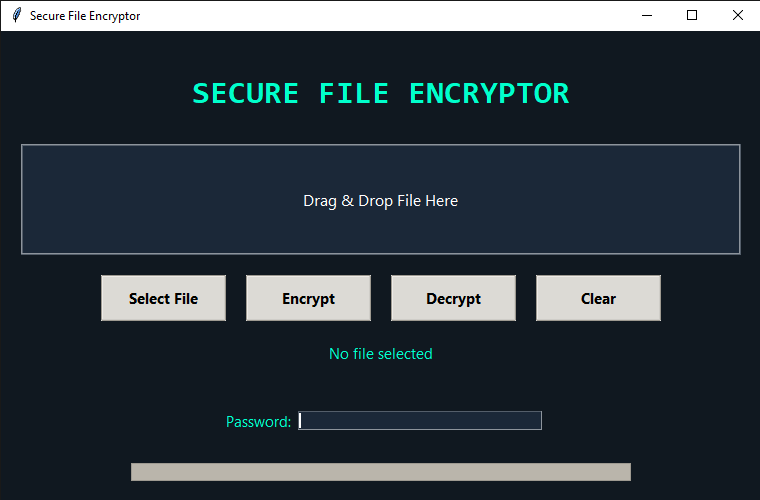

# Secure File Encryptor

Professional AES-256 file encryption application.

## Features

- AES-256-GCM authenticated encryption
- PBKDF2 password key derivation
- Drag & Drop support
- Dark mode interface
- Secure file streaming
- Cross-platform support
- Integrity verification
- Wrong-password protection

---

## Installation

```bash
pip install -r requirements.txt
```

Run:

```bash
python main.py
```

---

## Security Warning

If you forget your password,
your encrypted files CANNOT be recovered.

No password recovery mechanism exists by design.

---

## Build Executable

Install PyInstaller:

```bash
pip install pyinstaller
```

Build:

```bash
pyinstaller --onefile --windowed main.py
```

---

## Screenshots

## Main Window




## Encryption Complete

(assets/screenshots/encryption_complete.png)

---

## Running Tests

```bash
pytest
```
